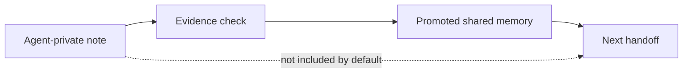

# Architecture

Multi-Agent Memory Isolation is a local file protocol plus a small CLI.

It is designed for agent teams where multiple tools touch the same codebase but should not share raw draft memory.

## Storage Layout

```text
.agent-memory/
  policy.json
  shared/
    memory.jsonl
  agents/
    codex/
      notes.jsonl
    claude/
      notes.jsonl
  handoffs/
    latest.md
  templates/
    codex.md
    claude.md
    hermes.md
    openclaw.md
```

## Record Types

Shared memory supports:

- `fact`
- `decision`
- `risk`
- `open_question`

Agent-private notes support:

- `observation`
- `decision`
- `risk`
- `question`

## Promotion Boundary

The main architectural decision is that memory is not shared by default.



An agent can write any draft note under its own name. That note stays private. To become shared memory, a record must be promoted with evidence.

## Validation

`agent-memory-isolation check` validates:

- required `.agent-memory/` paths exist;
- policy keeps private notes private;
- shared records use valid kinds;
- shared records are marked as shared;
- shared facts, decisions, and risks contain evidence;
- handoffs exist after shared memory is promoted;
- handoffs are newer than the shared memory they summarize;
- agent notes stay `agent_private`;
- memory text does not contain obvious secret-shaped strings or local home paths.

The built-in scan is intentionally conservative. It is not a replacement for secret scanning before public release.

## Non-Goals

Multi-Agent Memory Isolation does not:

- decide whether code is correct;
- replace tests or review;
- scrape private chats;
- run an embedding database by default;
- sync to a hosted service;
- make every agent's draft visible to every other agent.

## Package Shape

```text
src/agent-memory-isolation/
  cli.py          command-line interface
  store.py        local file store and record creation
  validation.py   checks for isolation and evidence rules
  render.py       handoff rendering
  models.py       shared constants and result models
  templates/      agent integration snippets
  schemas/        JSON schemas for public contracts
```

## Public Contracts

Schemas can be printed with:

```bash
agent-memory-isolation schema --kind shared-memory
agent-memory-isolation schema --kind agent-note
agent-memory-isolation schema --kind policy
```
